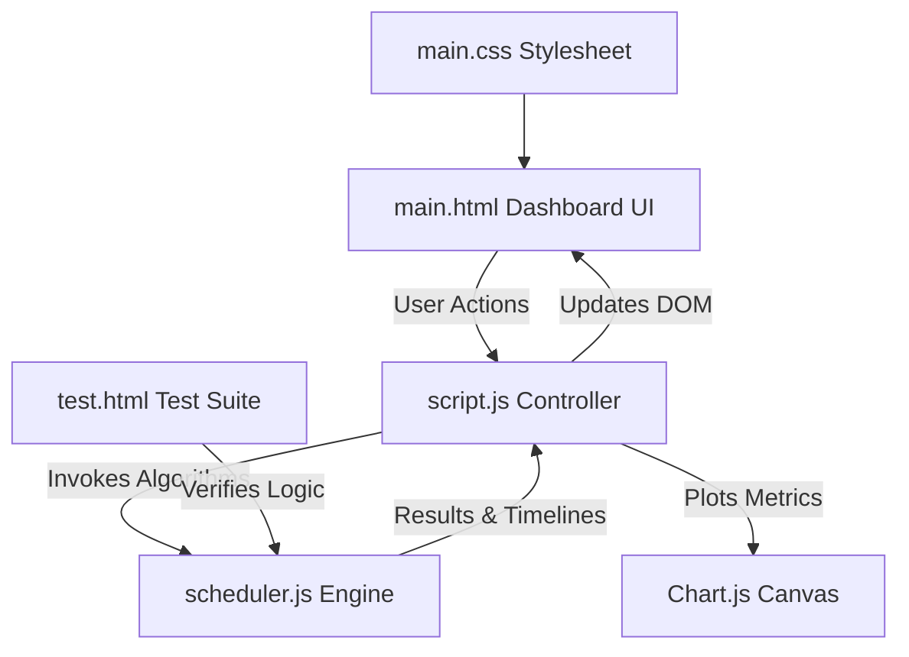

# Nexus CPU Scheduler Studio 🖥️

A high-performance, real-time interactive CPU scheduling simulator and performance analysis dashboard. Designed for SDE portfolio demonstration, this studio showcases operating systems scheduling theory, correct queue state machines, and comparative metrics visualization.

## 🚀 Live Demo & Visuals
* **Premium Dark Mode Dashboard**: Clean slate panel design with neon active status indicators.
* **Discrete-Time Step Simulation**: Play, pause, or step forward cycle-by-cycle to witness CPU preemption in real-time.
* **Side-by-Side Comparison**: Analyze multiple algorithms on identical workloads with performance comparison charts.

---

## 📚 CPU Scheduling Core Concepts & Formulations

The scheduling engine computes standard process metrics using discrete cycle timings:

$$TAT = CT - AT$$
$$WT = TAT - BT$$

* **Arrival Time ($AT$)**: The time unit at which a process enters the ready queue.
* **Burst Time ($BT$)**: The total CPU cycles required by the process to execute to completion.
* **Completion Time ($CT$)**: The clock cycle at which the process finishes execution.
* **Turnaround Time ($TAT$)**: The total latency elapsed from arrival to completion.
* **Waiting Time ($WT$)**: The total duration a process spends in the ready queue waiting for CPU cycles.
* **CPU Utilization**: The percentage of active execution cycles relative to total elapsed clock cycles.
* **Throughput**: The number of processes completed per clock cycle.

---

## ⚙️ Algorithms Implemented

### 1. First Come First Served (FCFS)
* Non-preemptive. Schedules processes strictly in order of their arrival ($AT$).

### 2. Shortest Job First (SJF)
* Non-preemptive. Selects the arrived process with the minimum total burst time ($BT$). Ties are resolved by earliest arrival.

### 3. Shortest Remaining Time First (SRTF)
* Preemptive variant of SJF. At each clock tick, the CPU is allocated to the process with the shortest remaining burst time. Preemption occurs immediately if a newly arrived process has a shorter remaining burst.

### 4. Round Robin (RR)
* Preemptive. Each process is allocated a fixed time slice (Quantum $q$). A dynamic Ready Queue is maintained. When a process's quantum expires, it is placed at the back of the queue, after any new processes that arrived during its execution slice.

### 5. Priority Scheduling (Non-Preemptive)
* Allocates the CPU to the process with the highest priority (configured as lower priority number = higher execution precedence).

### 6. Preemptive Priority Scheduling
* Preemptive. A running process is immediately preempted if a process with a higher priority (lower value) arrives in the ready queue.

### 7. Multi-Level Feedback Queue (MLFQ)
* An advanced, highly adaptive scheduling algorithm utilizing 3 feedback queues:
  * **Queue 1 (Q1)**: Highest priority. Round Robin with configurable quantum $q_1$ (default 2).
  * **Queue 2 (Q2)**: Medium priority. Round Robin with configurable quantum $q_2$ (default 4).
  * **Queue 3 (Q3)**: Lowest priority. First Come First Served (FCFS).
* **Demotion**: If a process uses its entire quantum in a higher queue without completing, it is demoted to the next lower queue.
* **Starvation Prevention (Aging)**: To prevent starvation of lower-priority processes, any waiting process in Q2 or Q3 is promoted to Q1 after a configurable `Aging Interval` of wait cycles.

---

## 🛠️ Project Architecture



* **[main.html](file:///e:/rtcs/RTCS/main.html)**: Declares the dashboard semantic structure, inputs, simulation controls, ready queue displays, table grids, and canvas.
* **[main.css](file:///e:/rtcs/RTCS/main.css)**: Implements custom slate-900 CSS dark theme, responsive grids, and animated Gantt chart segments.
* **[scheduler.js](file:///e:/rtcs/RTCS/scheduler.js)**: A decoupled, pure JavaScript scheduling engine containing correct, tested implementations of all 7 algorithms.
* **[script.js](file:///e:/rtcs/RTCS/script.js)**: The coordinator. Manages simulation clock loops, handles DOM events, maps active states, and calls Chart.js.
* **[test.html](file:///e:/rtcs/RTCS/test.html)**: The testing dashboard containing automated assertions validating all scheduling algorithms under complex edge cases (gaps, preemption, queue order).

---

## 🧪 Verification & Unit Testing

Correctness is critical for SDE-level engineering. To run the automated unit tests verifying the correctness of all algorithms:
1. Open the repository root.
2. Open `test.html` in your browser.
3. The page will execute the test assertions and display a detailed PASS/FAIL report.

---

## 💻 How to Run Locally

Since this is a lightweight static client application, you can run it via any local web server:

**Using Python:**
```bash
# In the project directory
python -m http.server 8000
# Or for python 2.7
python -m SimpleHTTPServer 8000
```
Then navigate to `http://localhost:8000/main.html`.